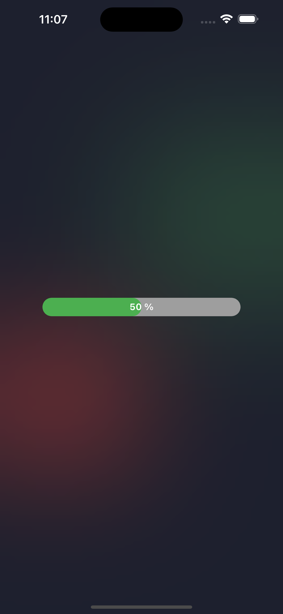
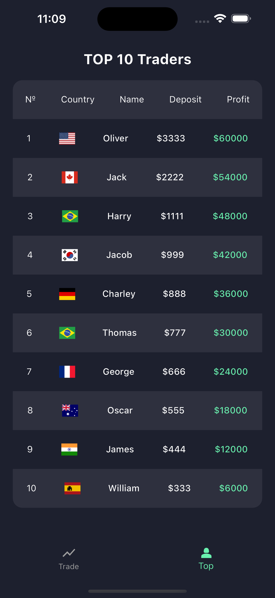

# Приложение, выполненное в качестве тестового задания
Ссылка на тестовое: https://www.figma.com/file/SdiMizFRMUrYtTI5LIh2v4/HM-%D0%A2%D0%B5%D1%81%D1%82%D0%BE%D0%B2%D0%BE%D0%B5-%D0%B7%D0%B0%D0%B4%D0%B0%D0%BD%D0%B8%D0%B5?type=design&node-id=0-1&t=PFpVcEGD9S4NDMJc-0 

### Особености приложения:
1. График подгружается через WebView
2. Выбор времени и ставки можно производить или вводя значения вручную или используя кнопки +/-
3. Объемная валидация на вводимое значение ставки
4. Кастомный бекграунд в 2х первых экранах

## Скриншоты приложения:

  
  

  

  
  

  
  

